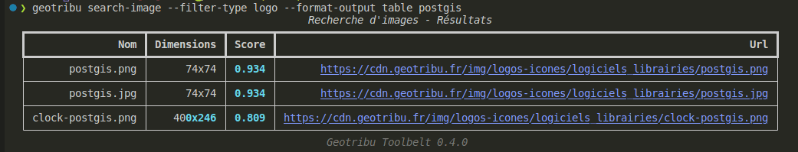

# Exemples

## Consulter les derniers contenus publiés

### Récupération simple

```sh
❯ geotribu read-latest
```

### Dernières GeoRDP sous forme de tableau

```sh
> geotribu read-latest -f rdp -o table
                                                          5 derniers contenus publiés  
┏━━━━━━━━━━━━━━━━━━━━━━━━━━━━━━━━━━━━━┳━━━━━━━━━━━━━━━━━━━━━┳━━━━━━━━━━┳━━━━━━━━━━━━━━━━━━━━━━━━━━━━━━━━━━━━━━━━━━━━━━━━━━━━━━━━━━━━━━━━━━━━━━┓
┃ Titre                               ┃ Date de publication ┃ Auteur/e ┃                                                                  URL ┃
┡━━━━━━━━━━━━━━━━━━━━━━━━━━━━━━━━━━━━━╇━━━━━━━━━━━━━━━━━━━━━╇━━━━━━━━━━╇━━━━━━━━━━━━━━━━━━━━━━━━━━━━━━━━━━━━━━━━━━━━━━━━━━━━━━━━━━━━━━━━━━━━━━┩
│ Revue de presse du 16 décembre 2022 │  16 décembre 2022   │ Geotribu │ https://static.geotribu.fr/rdp/2022/rdp_2022-12-16/?utm_campaign=fe… │
├─────────────────────────────────────┼─────────────────────┼──────────┼──────────────────────────────────────────────────────────────────────┤
│ Revue de presse du 2 décembre 2022  │  02 décembre 2022   │ Geotribu │ https://static.geotribu.fr/rdp/2022/rdp_2022-12-02/?utm_campaign=fe… │
├─────────────────────────────────────┼─────────────────────┼──────────┼──────────────────────────────────────────────────────────────────────┤
│ Revue de presse du 18 novembre 2022 │  18 novembre 2022   │ Geotribu │ https://static.geotribu.fr/rdp/2022/rdp_2022-11-18/?utm_campaign=fe… │
├─────────────────────────────────────┼─────────────────────┼──────────┼──────────────────────────────────────────────────────────────────────┤
│ Revue de presse du 4 novembre 2022  │  04 novembre 2022   │ Geotribu │ https://static.geotribu.fr/rdp/2022/rdp_2022-11-04/?utm_campaign=fe… │
├─────────────────────────────────────┼─────────────────────┼──────────┼──────────────────────────────────────────────────────────────────────┤
│ Revue de presse du 21 octobre 2022  │   21 octobre 2022   │ Geotribu │ https://static.geotribu.fr/rdp/2022/rdp_2022-10-21/?utm_campaign=fe… │
└─────────────────────────────────────┴─────────────────────┴──────────┴──────────────────────────────────────────────────────────────────────┘
                                                            Geotribu Toolbelt 0.7.0  

```

## Rechercher une image

### Recherche simple

```sh
> geotribu search-image postgis
[
    {'nom': 'postgis_db.png', 'dimensions': '400x79', 'score': '9.47', 'url': 'https://cdn.geotribu.fr/img/articles-blog-rdp/serveur/giscloud/postgis_db.png'},
    {
        'nom': 'qgis_postgis_EP.png',
        'dimensions': '790x454',
        'score': '9.47',
        'url': 'https://cdn.geotribu.fr/img/articles-blog-rdp/articles/qgis_postgis_eclairage_public/qgis_postgis_EP.png'
    },
    {
        'nom': 'qgis_postgis_osm_listing.webp',
        'dimensions': '799x390',
        'score': '9.47',
        'url': 'https://cdn.geotribu.fr/img/articles-blog-rdp/articles/postgis_osm_setup/qgis_postgis_osm_listing.webp'
    },
[...]
```

### Filtrer sur un type

```sh
> geotribu search-image postgis --filter-type logo
[
    {'nom': 'postgis.png', 'dimensions': '74x74', 'score': '0.934', 'url': 'https://cdn.geotribu.fr/img/logos-icones/logiciels_librairies/postgis.png'},
    {'nom': 'postgis.jpg', 'dimensions': '74x74', 'score': '0.934', 'url': 'https://cdn.geotribu.fr/img/logos-icones/logiciels_librairies/postgis.jpg'},
    {'nom': 'clock-postgis.png', 'dimensions': '400x246', 'score': '0.809', 'url': 'https://cdn.geotribu.fr/img/logos-icones/logiciels_librairies/clock-postgis.png'}
]
```

### Sortie sous forme de tableau

```bash
> geotribu search-image --filter-type logo --format-output table postgis
                                               Recherche d'images - Résultats  
┏━━━━━━━━━━━━━━━━━━━┳━━━━━━━━━━━━┳━━━━━━━┳━━━━━━━━━━━━━━━━━━━━━━━━━━━━━━━━━━━━━━━━━━━━━━━━━━━━━━━━━━━━━━━━━━━━━━━━━━━━━━━━━┓
┃               Nom ┃ Dimensions ┃ Score ┃                                                                             Url ┃
┡━━━━━━━━━━━━━━━━━━━╇━━━━━━━━━━━━╇━━━━━━━╇━━━━━━━━━━━━━━━━━━━━━━━━━━━━━━━━━━━━━━━━━━━━━━━━━━━━━━━━━━━━━━━━━━━━━━━━━━━━━━━━━┩
│       postgis.png │      74x74 │ 0.934 │       https://cdn.geotribu.fr/img/logos-icones/logiciels_librairies/postgis.png │
├───────────────────┼────────────┼───────┼─────────────────────────────────────────────────────────────────────────────────┤
│       postgis.jpg │      74x74 │ 0.934 │       https://cdn.geotribu.fr/img/logos-icones/logiciels_librairies/postgis.jpg │
├───────────────────┼────────────┼───────┼─────────────────────────────────────────────────────────────────────────────────┤
│ clock-postgis.png │    400x246 │ 0.809 │ https://cdn.geotribu.fr/img/logos-icones/logiciels_librairies/clock-postgis.png │
└───────────────────┴────────────┴───────┴─────────────────────────────────────────────────────────────────────────────────┘
                                                  Geotribu Toolbelt 0.4.0  

```

Sous forme d'images pour se rendre compte des couleurs (Bash, Ubuntu) :



----

## Ouvrir un résultat

Après une commande de recherche, il est possible d'afficher un résultat parmi ceux retournés en utilisant le numéro de ligne (index 0).

```sh
# recherche de contenu
> geotribu sc fme
                                                      Recherche de contenus - 5/61 résultats avec le terme : fme  
                                                           (ctrl+clic sur le titre pour ouvrir le contenu)  
┏━━━┳━━━━━━━━━━━━━━━━━━━━━━━━━━━━━━━━━━━━━━━━━━━━━━━━━━━━━━━━━━━┳━━━━━━━━━┳━━━━━━━━━━━━━━━━━━━━━┳━━━━━━━┳━━━━━━━━━━━━━━━━━━━━━━━━━━━━━━━━━━━━━━━━━━━━━━━━━━━━━━━━━━━━┓
┃ # ┃ Titre                                                     ┃  Type   ┃ Date de publication ┃ Score ┃                                                  Mots-clés ┃
┡━━━╇━━━━━━━━━━━━━━━━━━━━━━━━━━━━━━━━━━━━━━━━━━━━━━━━━━━━━━━━━━━╇━━━━━━━━━╇━━━━━━━━━━━━━━━━━━━━━╇━━━━━━━╇━━━━━━━━━━━━━━━━━━━━━━━━━━━━━━━━━━━━━━━━━━━━━━━━━━━━━━━━━━━━┩
│ 0 │ Passer les données de bande de FME à GDAL pour créer le   │ Article │    02 août 2022     │ 60.8  │                                     FME,GDAL,Python,raster │
│   │ raster de proximité                                       │         │                     │       │                                                            │
├───┼───────────────────────────────────────────────────────────┼─────────┼─────────────────────┼───────┼────────────────────────────────────────────────────────────┤
│ 1 │ FME World Tour 2020 - Edition Veremes online              │ GeoRDP  │     15 mai 2020     │ 57.8  │                        FME,GDAL,GeoMapFish,GeoServer,GRASS │
│   │                                                           │         │                     │       │                              GIS,OpenStreetMap,Python,QGIS │
├───┼───────────────────────────────────────────────────────────┼─────────┼─────────────────────┼───────┼────────────────────────────────────────────────────────────┤
│ 2 │ API Python de FME : comment travailler avec des rasters   │ Article │    02 août 2022     │ 56.3  │                                     FME,GDAL,Python,raster │
│   │ et GDAL                                                   │         │                     │       │                                                            │
├───┼───────────────────────────────────────────────────────────┼─────────┼─────────────────────┼───────┼────────────────────────────────────────────────────────────┤
│ 3 │ Conférence FME 2021                                       │ GeoRDP  │     21 mai 2021     │ 52.4  │                                             cadastre,carte │
│   │                                                           │         │                     │       │ routière,CloudCompare,ENSG,GraphHopper,IGN,OpenStreetMap,… │
│   │                                                           │         │                     │       │                                                       QGIS │
├───┼───────────────────────────────────────────────────────────┼─────────┼─────────────────────┼───────┼────────────────────────────────────────────────────────────┤
│ 4 │ Nouveau transformer révolutionnaire pour FME : RRIP       │ GeoRDP  │     12 mai 2023     │ 42.2  │ Afigéo,armée,cybersécurité,Discord,écosystème,FME,géomati… │
│   │ (Rename, Remarketing and Increase Prices)                 │         │                     │       │                                                            │
└───┴───────────────────────────────────────────────────────────┴─────────┴─────────────────────┴───────┴────────────────────────────────────────────────────────────┘
                                                                       Geotribu Toolbelt 0.16.0  
> geotribu ouvrir 1
```
