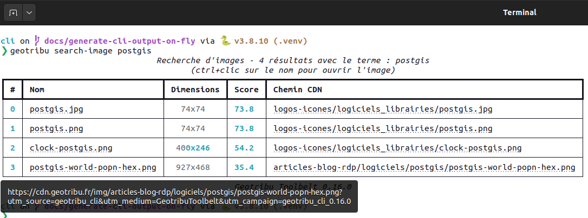

# Exemples

:::{note}
Les sorties présentées sur cette page sont générées automatiquement durant la génération de la documentation dans la CI. Elles ne sont donc pas représentatives du rendu sur le terminal de chacun/e.
:::

## Aide

```sh
geotribu --help
```

Sortie :

```{eval-rst}
.. literalinclude:: ./cli_sample_help.txt
  :language: shell
```

----

## Consulter les derniers contenus publiés

### Récupération simple

```sh
geotribu read-latest
```

Sortie :

```{eval-rst}
.. literalinclude:: ./cli_sample_rss.txt
  :language: shell
```

### Dernières GeoRDP sous forme de tableau

```sh
geotribu read-latest -f rdp -o table
```

Sortie :

```{eval-rst}
.. literalinclude:: ./cli_sample_rss_rdp.txt
  :language: shell
```

----

## Rechercher un contenu

### Recherche simple

```sh
geotribu sc orfeo
```

Sortie :

```{eval-rst}
.. literalinclude:: ./cli_sample_search_content_orfeo.txt
  :language: shell
```

### Rechercher avancée : forcer la présence d'un mot dans le titre et afficher jusqu'à 10 résultats

```sh
geotribu sc -n 10 "+title:openstreetmap postgis"
```

Sortie :

```{eval-rst}
.. literalinclude:: ./cli_sample_search_content_advanced.txt
  :language: shell
```

### Filtrer sur un type et présenter sous forme de JSON

```sh
geotribu search-image postgis --filter-type logo
```

Sortie :

```{eval-rst}
.. literalinclude:: ./cli_sample_search_images_postgis_logos_json.txt
  :language: json
```

----

## Rechercher une image

### Recherche simple

```sh
geotribu search-image postgis
```

Sortie :

```{eval-rst}
.. literalinclude:: ./cli_sample_search_images_postgis.txt
  :language: shell
```

Voici une capture d'écran de la sortie pour se rendre compte des couleurs (Bash, Ubuntu) :



### Filtrer sur un type et présenter sous forme de JSON

```sh
geotribu search-image postgis --filter-type logo
```

Sortie :

```{eval-rst}
.. literalinclude:: ./cli_sample_search_images_postgis_logos_json.txt
  :language: json
```

### Recherches avancées

#### Seulement dans le nom du fichier

On peut préfixer avec le champ sur lequel faire correspondre le terme de recherche. Exemple pour ne chercher que dans le nom du fichier :

```sh
geotribu img search name:qgis
```

Sortie :

```{eval-rst}
.. literalinclude:: ./cli_sample_search_images_name_qgis.txt
  :language: shell
```

#### Deux termes avec _OR_

Quand il y a 2 termes, c'est la clause `OR` qui s'applique. Exemple, les images qui correspondent à `openstreetmap` **ou** `logo` :

```sh
geotribu img search "openstreetmap logo"
```

Sortie :

```{eval-rst}
.. literalinclude:: ./cli_sample_search_images_openstreetmap_or_logo.txt
  :language: shell
```

#### Deux termes avec _AND_

Pour rechercher les images qui correspondent à `openstreetmap` **et** `logo`, on utilise le préfixe `+` :

```sh
geotribu img search "+openstreetmap +logo"
```

Sortie :

```{eval-rst}
.. literalinclude:: ./cli_sample_search_images_openstreetmap_and_logo.txt
  :language: shell
```

#### Dans le nom du fichier ET dans le chemin

On peut ainsi cumuler des filtres sur des champs et des opérateurs de présence :

```sh
geotribu img search "+path:logo +name:qgis"
```

Sortie :

```{eval-rst}
.. literalinclude:: ./cli_sample_search_images_path_logo_name_qgis.txt
  :language: shell
```

----

## Ouvrir un résultat

Après une commande de recherche, il est possible d'afficher un résultat parmi ceux retournés en utilisant le numéro de ligne (index 0).

```sh
# recherche de contenu
> geotribu sc fme
                                                      Recherche de contenus - 5/61 résultats avec le terme : fme  
                                                           (ctrl+clic sur le titre pour ouvrir le contenu)  
┏━━━┳━━━━━━━━━━━━━━━━━━━━━━━━━━━━━━━━━━━━━━━━━━━━━━━━━━━━━━━━━━━┳━━━━━━━━━┳━━━━━━━━━━━━━━━━━━━━━┳━━━━━━━┳━━━━━━━━━━━━━━━━━━━━━━━━━━━━━━━━━━━━━━━━━━━━━━━━━━━━━━━━━━━━┓
┃ # ┃ Titre                                                     ┃  Type   ┃ Date de publication ┃ Score ┃                                                  Mots-clés ┃
┡━━━╇━━━━━━━━━━━━━━━━━━━━━━━━━━━━━━━━━━━━━━━━━━━━━━━━━━━━━━━━━━━╇━━━━━━━━━╇━━━━━━━━━━━━━━━━━━━━━╇━━━━━━━╇━━━━━━━━━━━━━━━━━━━━━━━━━━━━━━━━━━━━━━━━━━━━━━━━━━━━━━━━━━━━┩
│ 0 │ Passer les données de bande de FME à GDAL pour créer le   │ Article │    02 août 2022     │ 60.8  │                                     FME,GDAL,Python,raster │
│   │ raster de proximité                                       │         │                     │       │                                                            │
├───┼───────────────────────────────────────────────────────────┼─────────┼─────────────────────┼───────┼────────────────────────────────────────────────────────────┤
│ 1 │ FME World Tour 2020 - Edition Veremes online              │ GeoRDP  │     15 mai 2020     │ 57.8  │                        FME,GDAL,GeoMapFish,GeoServer,GRASS │
│   │                                                           │         │                     │       │                              GIS,OpenStreetMap,Python,QGIS │
├───┼───────────────────────────────────────────────────────────┼─────────┼─────────────────────┼───────┼────────────────────────────────────────────────────────────┤
│ 2 │ API Python de FME : comment travailler avec des rasters   │ Article │    02 août 2022     │ 56.3  │                                     FME,GDAL,Python,raster │
│   │ et GDAL                                                   │         │                     │       │                                                            │
├───┼───────────────────────────────────────────────────────────┼─────────┼─────────────────────┼───────┼────────────────────────────────────────────────────────────┤
│ 3 │ Conférence FME 2021                                       │ GeoRDP  │     21 mai 2021     │ 52.4  │                                             cadastre,carte │
│   │                                                           │         │                     │       │ routière,CloudCompare,ENSG,GraphHopper,IGN,OpenStreetMap,… │
│   │                                                           │         │                     │       │                                                       QGIS │
├───┼───────────────────────────────────────────────────────────┼─────────┼─────────────────────┼───────┼────────────────────────────────────────────────────────────┤
│ 4 │ Nouveau transformer révolutionnaire pour FME : RRIP       │ GeoRDP  │     12 mai 2023     │ 42.2  │ Afigéo,armée,cybersécurité,Discord,écosystème,FME,géomati… │
│   │ (Rename, Remarketing and Increase Prices)                 │         │                     │       │                                                            │
└───┴───────────────────────────────────────────────────────────┴─────────┴─────────────────────┴───────┴────────────────────────────────────────────────────────────┘
                                                                       Geotribu Toolbelt 0.16.0  
> geotribu ouvrir 1
```

----

## Consulter les derniers commentaires

```sh
geotribu comments latest --results-number 5
```

Sortie :

```{eval-rst}
.. literalinclude:: ./cli_sample_comments_latest.txt
  :language: shell
```

----

## Optimiser des images pour le CDN Geotribu

:::{note}
Par défaut, le redimensionnement et l'optimisation des images font appel à l'API Tinify (<https://tinypng.com>) et requièrent une clé d'authentification à stocker en variable d'environnement `TINIFY_API_KEY`.

Pour une exécution en local, il est nécessaire d'installer les dépendances supplémentaires :

```sh
pip install -U geotribu[img-local]
```

:::

Cette commande permet de conformer les images aux bonnes pratiques et de les optimiser.

> Voir [la section dédiée du guide de contribution](https://contribuer.geotribu.fr/guides/cdn-images-hebergement/#bonnes-pratiques)

A partir d'une URL :

```sh
geotribu images optimize https://cdn.geotribu.fr/img/tuto/aerialod/oceania_aerialod.jpg
```

A partir d'un fichier local :

```sh
geotribu images optimize ~/Images/Geotribu/images/illustration_rdp.png
```

A partir d'un dossier local :

```sh
geotribu images optimize ~/Images/Geotribu/images/
```

----

## Réseaux sociaux

### Diffuser les commentaires du site

De façon à publiciser les commentaires postés sur les contenus du site, il est possible de les publier sur nos réseaux sociaux (actuellement, seul Mastodon est supporté).

Prérequis :

- clé d'API du compte Mastodon de Geotribu
- accès réseau sur l'instance Mastodon et à <https://comments.geotribu.fr>

Diffuser le dernier commentaire validé :

```sh
geotribu comments broadcast -t mastodon
```

Diffuser un commentaire en particulier avec son identifiant :

```sh
geotribu comments broadcast -t mastodon -c 379
```

Si un commentaire a déjà été publié auparavant, il n'est pas republié et le message suivant s'affiche :

```sh
✅ 🗨 Commentaire 379 déjà publié précédemment sur Mastodon :
https://mapstodon.space/@geotribu/113089336981322658
```

:::{note}
Sur Mastodon, la diffusion tient compte du fil (thread) de commentaires : un commentaire publié en réponse à un commentaire est diffusé comme réponse au post (toot) correspondant au commentaire initial.
:::

### Exporter les données du compte Mastodon

Utile pour le partage des comptes suivis et listes (voir [cet article](https://geotribu.fr/articles/2024/2024-02-16_de-twitter-a-mastodon-guide-geo-import-liste-comptes/))

```sh
geotribu social mastodon-export
```

Préciser le dossier de sortie :

```sh
geotribu social mastodon-export -w ./export-mastodon
```
