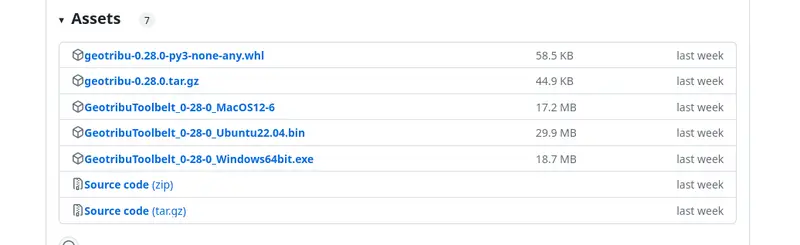

# Installation

Il est possible d'installer le projet de plusieurs façons différentes, en plus de [celle du mode développement](../development/setup).

## Utiliser comme package Python

C'est la méthode la plus simple et recommandée pour utiliser le CLI Geotribu.

### Prérequis

- Python >= 3.10
- a minima le couple [pip](https://pip.pypa.io/en/stable/installation/) et [venv](https://docs.python.org/3/library/venv.html) ou idéalement [pipx](https://pipx.pypa.io/latest/installation/) seul suffit et facilite la vie
- Accès réseau sur :
    - le dépôt officiel de paquets Python : <https://pypi.org/>
    - les différents sous-domaines de Geotribu <https://*geotribu.fr>
    - le site des données NTLK <https://www.nltk.org/nltk_data/>

### Installer

Avec les dépendances pour un usage classique :

```sh
# avec pipx
pipx install geotribu
# ou avec pip
pip install --upgrade geotribu
```

Avec les dépendances pour un usage contributeur :

```sh
# avec pipx
pipx install geotribu[all]
# ou avec pip
pip install --upgrade geotribu[all]
```

L'outil est désormais disponible en ligne de commande. Voir les [exemples](examples.md).

#### Guide : installer temporairement sur Ubuntu

Voici un exemple de commandes pour installer le CLI dans un environnement virtuel temporaire sur Ubuntu :

```sh
cd /tmp
mkdir geotribu-cli
cd geotribu-cli
python3 -m venv .venv
. .venv/bin/activate
python -m pip install -U pip setuptools wheel
python -m pip install geotribu[all]
```

Tester l'installation :

```sh
geotribu --version
```

----

## Avec Docker

Le paquet est publié sous forme d'image Docker dans le registre du dépôt GitHub (GHCR):

```sh
docker pull ghcr.io/geotribu/cli
```

Voir [la page dédié pour plus d'options](https://github.com/geotribu/cli/pkgs/container/cli).

----

## Utiliser comme exécutable autonome

:::{warning}
La version packagée pour MacOS n'est pas testée et ici pour encourager les feedback pour l'améliorer.
:::

1. Télécharger l'exécutable correspondant à son système depuis la partie _assets_ de la dernière version publiée sur [GitHub Release](https://github.com/geotribu/cli/releases/latest):

  

1. S'assurer que le fichier a les droits d'exécution (par exemple sur Linux: `chmod u+x ./GeotribuToolbelt_XXXXXX`)
1. Ouvrir une fenêtre de son terminal préféré dans le dossier
1. Exécuter le CLI à partir du nom du fichier (astuce : taper seulement `Geotri` puis appuyer sur tabulation pour utiliser l'autocomplétion)

--> voir [la page présentant les exemples d'utilisation](examples.md)
